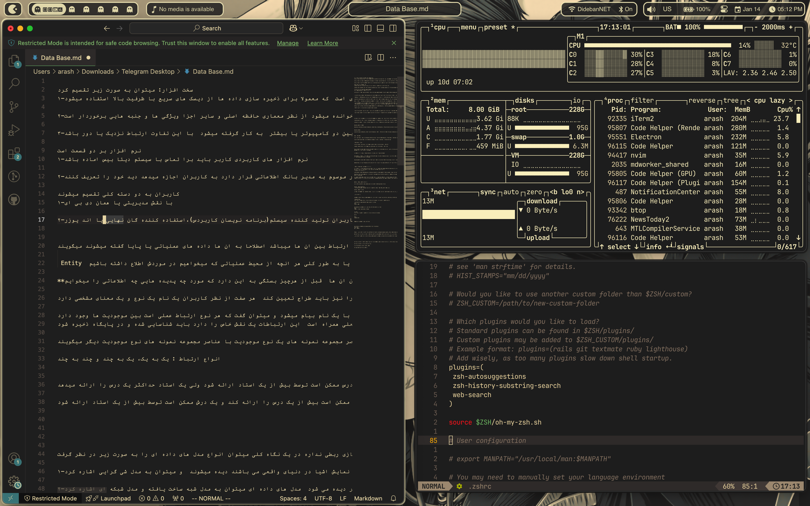
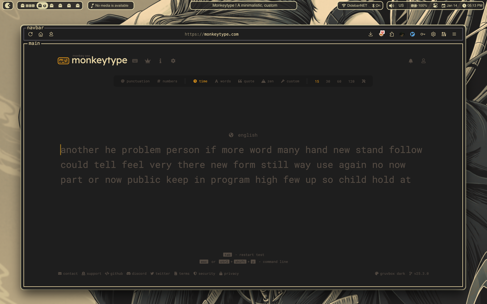

 # Gruvbox rice 
minimal stupe with simple bar sketchybar config

## Screenshots

## Credits
use *[textfox](https://github.com/adriankarlen/textfox/)* for firefox theme
Menubar: *[Sketchybar](https://github.com/FelixKratz/SketchyBar)*
